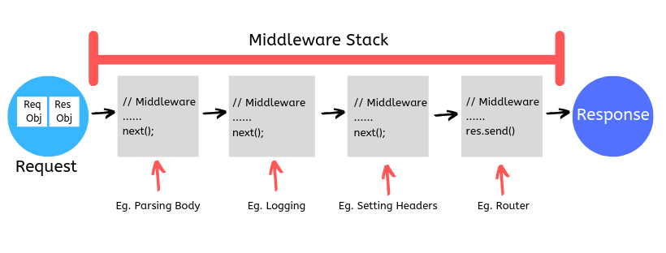

# Express.js

## What is Express.js?

Express.js, or simply Express is a backend web application framework for Node.js. You can assume express as a layer built on the top of the Node.js that helps manage a server and routes. It provides a robust set of features to develop web and mobile applications.

## Core features of Express

1. It can be used to design single-page, multi-page and hybrid web applications.
2. It allows to setup middleware to respond to HTTP Requests.
3. It defines a routing table which is used to perform different actions based on HTTP method and URL.
4. It allows to dynamically render HTML Pages based on passing arguments to templates.

## Installing Express

Create a project directory and change into it

```bash
$ mkdir myapp
$ cd myapp
```

npm init command will create Package.json in the application 

```bash
$ npm init
```

Install express

```bash
$ npm install express
```

Install Nodemon (Live reload of the app) as dev dependency

```bash
$ npm install --save-dev nodemon
```

Modify the start script in Package.json (file should look like as following)

```json
{
  "name": "name of project",
  "version": "1.0.0",
  "description": "",
  "main": "app.js",
  "scripts": {
    "start": "nodemon app.js" 
  	},
  "author": "",
  "license": "ISC",
  "dependencies": {
    "express": "^4.17.1"
  	},
  "devDependencies": {
    "nodemon": "^2.0.13"
  	}
}
```

## Create basic server using Express

Create app.js file : it will be entry point of the app 

Import express

```javascript

```

The app variable has multiple methods related to the http protocol. GET, POST, PUT, DELETE, ALL, USE

```javascript
//Import express
const express = require('express');
const app = express();

// http get mthods 
app.get('/', (req, res)=>{
    res.send('Home Page')
})

app.get('/about', (req, res)=>{
    res.send('About page')
})

// all method acts as error page redirection 
// when cleint hit the endpoint which is not implemented.
app.all('*', (req,res)=>{
   res.status(404); 
   res.send('resource not found');
})

// listen to the server on specified port 
app.listen(5000, ()=>{
    console.log('server is listening on port 5000...');
})
```

**Anatomy of get method**

get method takes two parameters : Path and a function. The function holds the logic to perform the task when client hit the specified path. The function takes two parameters ```req```: request and ```res```: response. ```req``` holds the data which is arrived from client, we can access and modify the arrived data by accessing the ```req``` variable. ```res``` is used to send data to the client, this data can be string, JSON object or even an html page. The app. method can be chained through multiple middleware in order to modify the and perform the operations. ```status``` method of ```res``` attach the status code with the response from server. Express generally do it automatically, but it can be modify by in the server code. 

## API vs. SSR  

Express.js can be used to perform basically following two operations. With express you can either setup API or SSR

| API                                                          | SSR(Server side Rendering)                                   |
| ------------------------------------------------------------ | ------------------------------------------------------------ |
| setting up an HTTP interface to interact with our data. Data transfer will happen in JSON form. | Deal with the data as well as the template in which data is rendered |
| Sends just DATA                                              | Server sends the entire html template upon request           |
| res.json() method perform the heavy lifting                  | res.render() method is mostly used                           |

In this document API approach is being used. To avoid working with templates and styles and focusing only on express functionality.

## Sample JSON Server

product.js : it holds the JSON data and file resides in the project directory. In more realistic scenario this data arrives from database and not from the server file.

```json
const products = [
{id:1,..}, {id:1,..}, {id:1,..}, {id:1,..}...
]
module.exports={products} // exporting the data object
```

App.js : serving the JSON data when URL is reached.

```javascript
const  express = require('express');
const app = express();
const { products } = require('./product')	// importing the json data from product.js file

app.get('/', (req,res)=>{
    res.json(products)	// responding with json data
});

app.listen(5000, ()=>{
    console.log('server listen on port 5000...');
});
```

**Restricting the property of object** :  It is not necessary to send entire object array in the beginning, rather just limited property should be sent. and when client request the entire data for one particular object, the entire that object will be sent.

```javascript
// sending just the id name and desc properties of the object
app.get('/api/products',(req,res)=>{
    const newProducts = products.map((product)=>{
        const {id, name, prop} = product;
        return {id, name, prop};
    })
    res.json(newProducts)
});
```

In above code when client hits the URL ```api/products``` , the function will be executed. In this function we are creating the new product object name ```newProducts``` this new product is mapped out from the product array and it just have 3 properties ```{id, name, prop}``` and this ```newProducts``` is responded.(check next section)

## Routing

*Routing* refers to determining how an application responds to a client request to a particular endpoint, which is a URI (or path) and a specific HTTP request method (GET, POST, and so on). Each route can have one or more handler functions, which are executed when the route is matched.

Route has following structure

```javascript
app.METHOD(PATH, HANDLER)
//app is an instance of express.
//METHOD is an HTTP request method, in lowercase.
//PATH is a path on the server.
//HANDLER is the function executed when the route is matched.
```

## Route paths

This route path will match requests to the root route, ```/```

```javascript
app.get('/', function (req, res) {
  res.send('root')
})
```

This route path will match `acd` and `abcd`.

```javascript
app.get('/ab?cd', function (req, res) {
  res.send('ab?cd')
})
```

This route path will match `abcd`, `abbcd`, `abbbcd`, and so on.

```javascript
app.get('/ab+cd', function (req, res) {
  res.send('ab+cd')
})
```

This route path will match `abcd`, `abxcd`, `abRANDOMcd`, `ab123cd`, and so on.

```javascript
app.get('/ab*cd', function (req, res) {
  res.send('ab*cd')
})
```

This route path will match `/abe` and `/abcde`.

```javascript
app.get('/ab(cd)?e', function (req, res) {
  res.send('ab(cd)?e')
})
```

This route path will match anything with an “a” in it.

```javascript
app.get(/a/, function (req, res) {
  res.send('/a/')
})
```

This route path will match `butterfly` and `dragonfly`, but not `butterflyman`, `dragonflyman`, and so on.

```javascript
app.get(/.*fly$/, function (req, res) {
  res.send('/.*fly$/')
})
```

## Route Parameter

**Finding specific Product** (getting full info. one particular product object) .  In order to obtain specific product data which is requested by the client.

```javascript
app.get('/api/products/1',(req,res)=>{
    const singleProduct = products.find((product)=> product.id===1)
    res.json(singleProduct);
});
```

The problem with the above code is that we have to implement the endpoint for each products. and as products increases new endpoints must be implemented, which is impractical. 

URL Parameters comes in handy for such situation. We can extract the value from the URL segment and use it to find that specific product as follow

```javascript
app.get('/api/products/:productID',(req,res)=>{
    console.log(req.params.productID);
    const productId = req.params.productID;
    console.log(productId);
    const singleProduct = products.find(
        (product)=> product.id === Number(productId)
        )
    // if there is no product with the requested if then send 404
    if(singleProduct){
        res.json(singleProduct);
    }
    else{
        res.status(404);
        res.send('product does not exist');
    }
});
```

```req.params.productID``` Holds the URL parameter value. The URL has ```:productID``` for placeholder for the parameter value. The parameters always has data type of string which need to be converted into integer if needed. ```find``` is the array method which is used to find the object in the array when id is specified.

**Multiple parameters in single URL**

Client can query the server with multiple parameters in the same URL, following way we can access this parameters it

Sample URL : ```/api/products/4/review/3``` where we have two parameters values : 4 and 3

```javascript
app.get('/api/products/:productId/review/:reviewId', (req, res)=>{
    console.log(req.params);
    res.send('you reached the multi params URL');
})
```

Output:

```bash
$ { productId: '4', reviewId: '3' }
```

## Query

The ```req.quer``` property is an object containing the property for each query string parameter in the route. Client can provide query parameters in the URL, and this query parameters can be accessed as follow

Query parameters can be attached to the URL using ```?``` and multiple query parameters can be chained using ```&```. Sample URL with 3 query parameters is as follow [Parameters : name, id, desc]

```/api/v1/queryParams?name=abc&id=1&desc=pqers```

This parameters can be access in express using ```req.query``` as follow

```javascript
app.get('/api/v1/queryParams', (req, res)=>{
    console.log(req.query);
    res.send('client reached to the query URL')
});
```

Output:

```bash
$ { name: 'abc', id: '1', desc: 'pqers' }
```

**Query example with search and limit functionality**

```javascript
app.get('/api/v1/queryParams', (req, res)=>{
    const { search, limit } = req.query;
    let sortedProducts = [...products];

    // logic to search the product
    if(search){
        sortedProducts = sortedProducts.filter((product)=>{
            return product.name.startsWith(search)
        });
       
    }
    
    // logic to get requested amount of product
    if(limit){
        sortedProducts = sortedProducts.slice(0, Number(limit))
    }
    
    // logic if no product matches to the request
    if(sortedProducts.length<1){
        res.status(200);
        res.send('no products matched your search');
    }
    res.status(200);
    res.json(sortedProducts)
});
```

## Middleware

Middleware literally means anything you put in the middle of one layer of the software and another.

Express middleware are functions that execute during the lifecycle of a request to the Express server. Each middleware has access to the HTTP ```request``` and ```response``` for each route (or path) it’s attached to. Additionally, middleware can either terminate the HTTP request or pass it on to another middleware function using ```next```. This “chaining” of middleware allows you to compartmentalize your code and create reusable middleware.



**Middleware example : Logger**

Adding a logger functionality which logs the ```method, url, time``` whenever client hits the endpoint. 

without middleware

```javascript
const  express = require('express');
const app = express();

app.get('/', (req,res)=>{
    
    // logger logic
    const method = req.method;
    const url = req.url;
    const time = new Date().getFullYear();
    
    console.log(method,url,time)
    res.send('Home');
})

app.get('/about', (req,res)=>{
    
    // logger logic
    const method = req.method;
    const url = req.url;
    const time = new Date().getFullYear();
    
    console.log(method,url,time)
    res.send('About');
})

app.listen(5000, ()=>{
    console.log('server listen on port 5000...');
});

```

The problem with above code is that logger logic is implemented multiple time. precisely one set of logger logic for each routes. Which is not practical because with more endpoints this logger logic will be implemented again. Which can be avoided by implementing the logger logic once and call it in multiple routes. Logger logic can be implemented as an middleware function which can be used by multiple routes. (see bellow)

```javascript
const  express = require('express');
const app = express();

const logger = (req, res, next)=>{
    const method = req.method;
    const url = req.url;
    const time = new Date().getFullYear();
    console.log(method,url,time)
    next();
}

app.get('/', logger, (req,res)=>{
    res.send('Home');
})

app.get('/about', logger, (req,res)=>{
    res.send('About');
})

app.listen(5000, ()=>{
    console.log('server listen on port 5000...');
});
```

As we can see the logger function (middleware) is implemented once, and called in each endpoint. Logger function has access to the ```req, res``` parameter of the endpoint also it has ```next()``` method. 

**Note:** The middleware function can be keep in another .js file, which can be exported and imported to the main project file, to make the main code clean.

**Apply middleware to all the routes by default**

In above example we manually called the logger middleware in all the routes. But express provide one more option where you do not need to manually call the middleware for each router, instead you can simply call the middleware once in the beginning and express will put this middleware in before each routes as follow

```javascript
const  express = require('express');
const app = express();
const logger = require('./logger');

// app.use will add the middleware before each routes automatically
app.use(logger);

app.get('/', (req,res)=>{
    res.send('Home');
})

app.get('/about', (req,res)=>{
    res.send('About');
})

app.get('/api/product', (req,res)=>{
    res.send('products');
})

app.get('/api/items', (req,res)=>{
    res.send('items');
})

app.listen(5000, ()=>{
    console.log('server listen on port 5000...');
});
```

**Note**: ```app.use()``` must be in the beginning of any routes. Otherwise it will not work

**Apply the middleware to the router to the specific paths** :  

```javascript
app.use('/api',logger);
// the logger middleware will be apply to the routes which has /api in thier path
// logger middleware will not apply to other routes
```

**Multiple Middleware**

groupOfMiddleware.js : contain two middleware

```javascript
var middleware = {
    requireAuthentication: function(req, res, next) {
        console.log('authentication middleware');
        next();
    },
    logger: function(req, res, next) {
       console.log('logger middleware');
       next();
    }
}

module.exports = middleware;
```

Using multiple middleware in the app.js

```javascript
const  express = require('express');
const app = express();
const middleware = require('./groupOfMiddleware');

// multiple middleware can be used as follow
app.get('/', [middleware.requireAuthentication, middleware.logger], (req,res)=>{
    res.send('Home');
})
 
app.listen(5000, ()=>{
    console.log('server listen on port 5000...');
});
```


## Routers and Controllers

As we have seen in above examples, the app.js is the entry point of the server, also it holds the request handling logic. Therefore if there are more number of routes with their logic, the ```app.js``` file will be bulky and very hard to maintain. In order to restructure the project we can create the controllers and routes. This way the ```app.js``` file will be clutter free and easy to read.

**Project structure**

```javascript
sampleProject
	|
	|----Controllers
	|		|	// logic to perform when client hit the route
	|		|----homeController.js
	|		|----controller1.js
	|		|----controller2.js
	|----routes
	|		|	// each controller has its onw route file
	|		|----homeControllerRoute.js
	|		|----controller1Route.js
	|		|----controller2Route.js
	|
	|----Services
	|		|	// services will be called from controllers
	|		|----service1.js
	|		|----service2.js
	|
	|----Model
	|		|	
	|		|----Model1.js
	|		|----Model2.js
	|	
	|----app.js	// entrypoint 
	|----package.json
	|----package-lock.json
	|----node_module
```

**Example Project with controllers and routers**

app.js :

```javascript
const  express = require('express');
const app = express();
const routes = require('./Routes/homeControllerRoutes');

app.use('/',routes)	// to use the routes 
 
app.listen(5000, ()=>{
    console.log('server listen on port 5000...');
});
```

homeController.js

```javascript
// import of service will happen here

const getAll = (req, res, next)=>{
    res.send('getAll function executed');
}

const newItem = (req, res, next)=>{
    res.send('newItem function executed');
}

const deleteAllItems = (req, res, next)=>{
    res.send('deleteAllItem function executed');
}

const getOneItem = (req, res, next)=>{
    res.send('getOneItem function executed');
}

const deleteOneItem = (req, res, next)=>{
    res.send('deleteOneItem function executed');
}

module.exports = { 
    getAll,
    newItem,
    deleteAllItems,
    getOneItem,
    deleteOneItem
};
```

homeControllerRoutes.js

```javascript
//this file holds the information about the route and their respective controllers

const express = require('express');
const router = express.Router();

const homeController = require('../controllers/homeController');

router.get('/', homeController.getAll);
router.get('/home', homeController.getAll);
router.post('/home', homeController.newItem);
router.delete('/home', homeController.deleteAllItems);

router.get('/home/:name', homeController.getOneItem);
router.delete('/home/:name', homeController.deleteOneItem);


module.exports = router;
```

Similarly other controllers can be implemented, without modifying the app.js file.